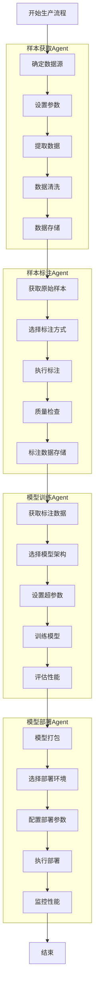

# 小模型生产工具Agent

基于Java和Spring-AI-Alibaba实现的小模型生产工具Agent，提供了从样本获取到模型部署的完整闭环流程。

## 系统架构

该系统由四个核心Agent组成，每个Agent负责模型生产流程中的不同阶段：

1. **样本获取Agent**: 负责从各种来源获取训练样本
2. **样本标注Agent**: 负责对原始样本进行标注
3. **模型训练与评测Agent**: 负责训练模型并评估其性能
4. **模型部署Agent**: 负责将训练好的模型部署到生产环境

这些Agent通过协作完成一个完整的模型生产流程，每个Agent都可以调用相应的工具来完成具体任务。

### 流程图

整体工作流程如下图所示：



## 技术栈

- Java 17
- Spring Boot 3.2.0
- Spring AI Alibaba 1.0.0.2
- Maven

## 快速开始

### 环境要求

- JDK 17+
- Maven 3.6+
- 通义千问API密钥

### 配置

1. 克隆项目到本地:

```bash
git clone https://github.com/yourusername/produce-tool-agent.git
cd produce-tool-agent
```

2. 配置API密钥:

在`application.yml`中配置您的通义千问API密钥，或通过环境变量设置:

```bash
export DASHSCOPE_API_KEY=your_api_key_here
```

### 构建和运行

1. 使用Maven构建项目:

```bash
mvn clean package
```

2. 运行应用:

```bash
java -jar target/produce-tool-agent-1.0-SNAPSHOT.jar
```

应用将在`http://localhost:8080`启动。

## API使用说明

### 1. 启动模型生产流程

**请求:**

```bash
curl -X POST http://localhost:8080/api/production/start \
  -H "Content-Type: application/json" \
  -d '{
    "modelType": "文本分类",
    "objective": "构建一个情感分析模型，识别文本的积极、消极或中性情感",
    "dataRequirements": "需要至少1000条带有情感标签的中文评论文本",
    "trainingParameters": {
      "learningRate": 0.001,
      "batchSize": 32,
      "epochs": 10
    },
    "evaluationCriteria": {
      "accuracy": 0.85,
      "f1": 0.80
    },
    "deploymentEnvironment": "测试环境",
    "requiresMonitoring": true
  }'
```

**响应:**

```json
{
  "success": true,
  "startTime": "2023-01-01T12:00:00",
  "endTime": "2023-01-01T12:30:00",
  "sampleAcquisitionResult": {...},
  "sampleAnnotationResult": {...},
  "modelTrainingResult": {...},
  "modelDeploymentResult": {...},
  "deployedModelInfo": "模型已部署到测试环境，API端点: https://test-api.example.com/model/deploy-123",
  "evaluationMetrics": "准确率: 0.87, F1: 0.86",
  "productionLogs": "..."
}
```

### 2. 查询生产状态

```bash
curl http://localhost:8080/api/production/{productionId}/status
```

### 3. 取消生产流程

```bash
curl -X POST http://localhost:8080/api/production/{productionId}/cancel
```

## 系统扩展

### 添加新工具

1. 创建继承自`AbstractAgentTool`的工具类:

```java
@Component
public class MyCustomTool extends AbstractAgentTool {
    public MyCustomTool() {
        super("myCustomTool", "工具描述");
    }
    
    @Override
    public ToolExecutionResult execute(String input, AgentToolCallback callback) {
        // 实现工具逻辑
        return ToolExecutionResult.success("执行结果");
    }
}
```

2. 将工具添加到相应Agent的可用工具列表中。

### 自定义Agent

1. 创建继承自`BaseReActAgent`的Agent类:

```java
@Component
public class MyCustomAgent extends BaseReActAgent {
    public MyCustomAgent(ChatClient chatClient, AgentConfig agentConfig, ToolRegistry toolRegistry) {
        super("agentName", "描述", "prompt模板", availableTools, chatClient, agentConfig, toolRegistry);
    }
    
    @Override
    protected String getTaskDescription() {
        return "任务描述";
    }
}
```

## 维护与贡献

- 提交问题或建议: [Issues](https://github.com/yourusername/produce-tool-agent/issues)
- 贡献代码: Fork本仓库，提交Pull Request

## 许可证

MIT License

# Produce Tool Agent 项目

## 安全配置 API 密钥

为了安全地使用API密钥而不将其提交到GitHub，请按照以下步骤操作：

### 方法一：使用环境变量（推荐）

1. 在IDEA中配置运行参数：
   - 打开"Run/Debug Configurations"
   - 在"Environment variables"字段中添加：`OPENAI_API_KEY=你的密钥`

   

2. 或者，在命令行中启动项目：
   ```bash
   OPENAI_API_KEY=你的密钥 ./mvnw spring-boot:run
   ```

### 方法二：使用Profile和本地配置文件

1. 我们已创建`application-local.yml`文件，它已被添加到`.gitignore`中
2. 在IDEA中配置启动Profile：
   - 打开"Run/Debug Configurations"
   - 在"Active profiles"字段中添加：`local`

### 方法三：使用命令行参数

通过以下方式启动应用：
```bash
./mvnw spring-boot:run -Dspring.ai.openai.api-key=你的密钥
```

**注意：** 永远不要将实际的API密钥提交到版本控制系统中。 